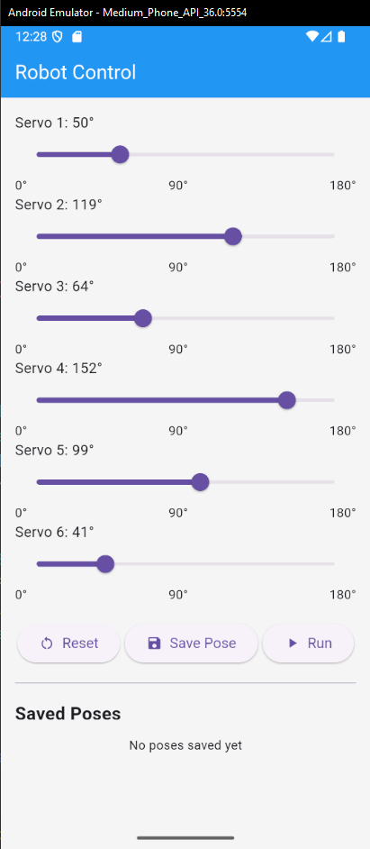
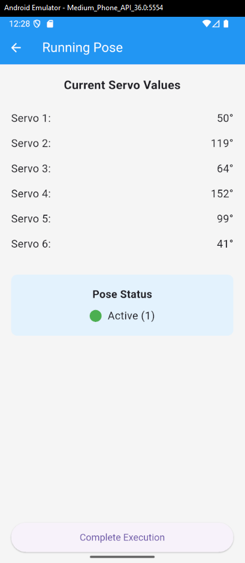

# Flutter-servo-control
This Android application controls a 6-servo robotic arm, allowing you to:

Adjust individual servo angles

Save custom servo configurations (poses)

Execute saved poses

Monitor real-time servo positions

## Key Features
1-Servo Control Interface

- Individual controls for 6 servos (0°-180° range)
- Visual indicators showing current servo positions
- Reset function to clear current settings

2-Pose Management

- Save custom servo configurations as named poses
- Execute saved poses with one click
- View active pose status during execution

3-Runtime Monitoring

- Real-time display of servo angles during operation
- Pose execution status indicator
- Completion control to end pose execution

## Usage Instructions
- Adjust Servos:

Drag sliders or input values directly for each servo

Current angle shown above each servo control (e.g., "Servo 1: 50°")

- Save Configuration:

Set desired angles

Click Save Pose and name your configuration

- Execute Pose:

Select saved pose from list

Click Run to activate

Monitor real-time angles in runtime view

- During Operation:

Check Active status indicator

View current servo positions

Press Complete Execution to finish
